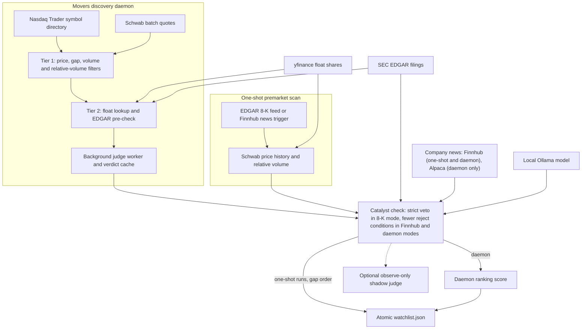

# Market momentum scanner

[](https://github.com/johnaadams122/market-momentum-scanner/actions/workflows/ci.yml)

A Python scanner for US-listed stocks that gap up on unusual volume before and during the regular session.
It screens and reports only; it places no orders. Results are written atomically to a versioned
`watchlist.json` for a separate consumer. Each candidate that passes the numeric filters gets a catalyst
check that combines SEC filing data with a local language model's reading of the filing or news text.
In both one-shot modes an unexpected error while checking a candidate makes it `REJECT`. What else the
check rejects depends on the mode:

- **One-shot, SEC 8-K trigger (default).** A strict gate: only a `real` label at or above the confidence
  floor (`CONF_MIN`) is `PROCEED`. A candidate is `REJECT` when its ticker is ineligible, its float or
  relative volume is missing or not finite, an SEC lookup fails, the SEC dilution check flags a recent
  offering, shelf or other dilution filing or a reverse split within the past year, the triggering 8-K
  has no catalyst-capable item (1.01, 2.02 or 8.01) or its text contains dilution or reverse-split
  language, or the model's answer is invalid, flags a fixed-price buyout, is not `real`, or is below
  the floor.
- **One-shot, `--source finnhub`.** Tickers come from Finnhub's general news feed and are kept only
  when Finnhub's company-news feed confirms the item. A candidate is `REJECT` when its ticker is
  ineligible, its float or relative volume is missing or not finite, an SEC lookup fails, no news is
  left after market-roundup headlines are dropped (unless a fallback check of the company's latest SEC
  current report gets a `real` answer at or above the floor), or the model's answer is invalid or flags
  a fixed-price buyout. Otherwise it is `PROCEED` whatever its label (`real`, `pump` or `no-data`); the
  label, confidence and dilution flag are only recorded. This mode does not rank or score: candidates
  are listed by gap, largest first, and `catalyst_score` is always `0.0`.
- **Movers daemon.** Each cycle filters the whole symbol universe (price, gap, volume, relative volume,
  then float and, during regular hours, a new high of day) and judges candidates that lack a fresh
  verdict, up to a per-cycle limit, with the same news check as the Finnhub mode (news from Finnhub or
  Alpaca). The same conditions reject, except that a news-feed or SEC failure, or another unexpected
  error in the check, leaves the ticker unjudged instead. Only candidates with a fresh verdict are
  written, `PROCEED` and `REJECT` alike, each with a `score` (`ranking.py`): gap times relative volume
  plus an SEC recent-filing term, reduced for large floats, plus a confidence- and source-weighted bonus
  for a `real` label only, all multiplied by a factor that demotes offering, shelf and
  unresolved-identity dilution flags. Rows are ordered by that score. Rows with an unknown float come
  after every known-float row, and only those unknown-float rows are capped (at 5, `UNKNOWN_FLOAT_CAP`
  in `config.py`); the number of known-float rows is not capped.

## Architecture



## Setup

Use Windows 11 or Windows Server 2022 (the CI runner image) with Python 3.13. The code needs Python 3.10 or
newer; only 3.13 is exercised. Run every command from the repository root.

```powershell
python -m venv .venv
& ./.venv/Scripts/python.exe -m pip install -r tools/momentum_scanner/requirements-dev.txt
$env:PYTHONPATH = (Resolve-Path ./tools).Path
```

`requirements.txt` lists the runtime packages (`requests`, `yfinance`, `anthropic`); `requirements-dev.txt`
adds `pytest` and, on Windows, the `tzdata` time-zone database that `zoneinfo` needs. The package lives in
`tools/momentum_scanner` and is imported as `momentum_scanner`, which is why `tools` goes on `PYTHONPATH`.

Configure the services under [External services](#external-services) before a live run. One-shot premarket scan:

```powershell
& ./.venv/Scripts/python.exe -m momentum_scanner --lookback 60 --json-out ./out/watchlist.json
```

The default trigger is the SEC 8-K feed; `--source finnhub` uses the Finnhub news trigger instead.
The movers discovery daemon needs an existing state folder. The launcher sets `PYTHONPATH` itself; your
PowerShell execution policy must allow local scripts.

```powershell
New-Item -ItemType Directory -Path ./state -Force | Out-Null
& ./tools/momentum_scanner/launch_scanner_discovery.ps1 -PythonExe ./.venv/Scripts/python.exe -StateDir ./state -Source finnhub
```

To run one discovery cycle and exit, call the daemon module directly:
`& ./.venv/Scripts/python.exe -m momentum_scanner.scanner_movers_daemon --state-dir ./state --once`
(with `PYTHONPATH` set as above). It exits non-zero when that cycle fails, including when it publishes
`status: error` or skips discovery for lack of rate budget, and when startup fails; outside the session
windows it only writes the heartbeat and exits 0.

## Synthetic example

Synthetic output only: the tickers, company names, prices and volumes below are invented to show the shape
of the schema-version-2 `watchlist.json` that `python -m momentum_scanner --json-out ./out/watchlist.json`
writes. Real output depends on live data and the configured model.

```json
{
  "schema_version": 2,
  "scan_id": "5f1c9a2e-7b3d-4e8a-9c41-2d6b8e3f7a15",
  "scanned_at": "2026-01-05T13:00:00+00:00",
  "expires_at": "2026-01-05T14:30:00+00:00",
  "status": "ok",
  "confirm_overflow": 0,
  "candidates": [
    {
      "ticker": "ZZQA",
      "company_name": "ZZQA",
      "premarket_price": 4.2,
      "prev_close": 3.5,
      "gap_pct": 0.2,
      "float_shares": 6000000,
      "premarket_volume": 900000,
      "baseline_volume": 60000.0,
      "rel_volume": 15.0,
      "catalyst": "Synthetic Example Corp files a current report",
      "gate_decision": "PROCEED",
      "catalyst_label": "real",
      "gate_reason": "synthetic example reason",
      "catalyst_confidence": 0.86,
      "catalyst_source": "llm",
      "dilution_flag": null,
      "catalyst_content_source": "none",
      "catalyst_score": 0.0
    }
  ]
}
```

`gap_pct` is a fraction (0.2 means 20 percent) and `expires_at` is `scanned_at` plus 90 minutes. In one-shot
output `company_name` is always the ticker, because Schwab price history carries no company name. A candidate
without a usable verdict is written as `REJECT` with label `no-data` in one-shot output; the movers daemon
leaves such candidates out instead. The movers daemon writes the same
envelope with extra per-candidate fields such as `score`, `scan_mode`, `day_high` and `edgar_signal`,
and it is the only mode that sets `catalyst_score`; one-shot output always has `0.0` there.

## Tests

Run from the repository root: two test modules read repository files by relative path and start Windows
PowerShell (the launcher tests run the daemon wrapper with a stand-in child process instead of Python).

```powershell
& ./.venv/Scripts/python.exe -m pip install -r tools/momentum_scanner/requirements-dev.txt
& ./.venv/Scripts/python.exe -m pytest tools/momentum_scanner/tests -q
```

CI executes the same selected tests directory after the declared fresh-environment dependency setup.

The documented suite uses synthetic data and mocks external services. Dependency
installation may use public package registries; tests are reviewed to run offline.
The CI badge reports the hosted workflow's status for its selected commit.

## External services

Live runs call the services below. Nothing is bundled: supply your own accounts, keys and adapter modules
through environment variables. The Finnhub key, the Alpaca key and secret and the SEC contact string
(`SEC_EDGAR_USER_AGENT`) are read from the environment when a request is made; the Anthropic key is read
from the environment by the Anthropic SDK; the Schwab bearer token is whatever your token-provider
module's `get_valid_token()` returns. This code sends the Finnhub, Alpaca, Schwab and SEC values only as
request headers (the SEC contact string as the `User-Agent` header).

Live mode (`SCANNER_MODE=live`) and the news sources. The Finnhub free tier is non-commercial, and
`FINNHUB_COMMERCIAL_USE` is a constant set to `False` in `config.py`, not an environment setting.

| Entry point and source | Behaviour with `SCANNER_MODE=live` |
|---|---|
| One-shot, default `--source edgar` | No news-source check; no Finnhub news is used. |
| One-shot `--source finnhub` | Refused before any Finnhub call: exits with code 1 and, with `--json-out`, writes a `status: error` watchlist. |
| Daemon `--source finnhub` | No check; runs on Finnhub. |
| Daemon `--source alpaca` | Alpaca only: the Finnhub fallback is dropped, so an Alpaca outage leaves the affected tickers unjudged. Without live mode, Finnhub is the fallback when Alpaca fails. |

| Service | Used for | You supply |
|---|---|---|
| SEC EDGAR (`www.sec.gov`, `data.sec.gov`) | 8-K feed, ticker-to-CIK map, filing history and filing documents for the dilution veto | `SEC_EDGAR_USER_AGENT`: your application name and a contact, as the SEC fair-access policy requires. Requests fail before sending when it is unset. |
| Schwab market data (`api.schwabapi.com/marketdata/v1`) | Batch quotes and premarket price history | Your own developer access and OAuth handling. Set `MARKET_MOMENTUM_TOKEN_PROVIDER` to an importable module whose `get_valid_token()` returns a current bearer token. |
| Rate limiter module (daemon) | Budgeting quote requests | `MARKET_MOMENTUM_RATE_LIMITER`: a module exposing `SchwabRateLimiter(state_path)` whose `acquire(n=..., tier=..., now=...)` grants budget. Without it every discovery cycle is skipped (fail closed) unless `DAEMON_ALLOW_UNGATED=1`; the running daemon writes `status: error` once the skips outlast the watchlist freshness window, and a `--once` run exits non-zero. `SCHWAB_RATE_LIMIT_STATE` optionally sets the state file. |
| Holiday calendar module (daemon) | Skipping exchange holidays | `MARKET_MOMENTUM_CALENDAR`: a module exposing `is_market_holiday(date)`. Without it every day is treated as a holiday and the daemon idles. |
| Finnhub (`finnhub.io`) | Company news, and the optional premarket news trigger | `FINNHUB_API_KEY`. The free tier is for non-commercial use; see the live-mode table above. |
| Alpaca news (`data.alpaca.markets`) | Optional primary news source for the movers daemon only, with Finnhub as fallback outside live mode (the one-shot scan never uses Alpaca) | `ALPACA_API_KEY_ID` and `ALPACA_API_SECRET_KEY`. Defaults differ by entry point. Running `scanner_movers_daemon` directly, `--source` defaults to the value of `SCANNER_NEWS_SOURCE`, which itself defaults to `finnhub`; pass `--source alpaca` or set `SCANNER_NEWS_SOURCE=alpaca` to use Alpaca. The PowerShell launcher always passes `--source` explicitly (it ignores `SCANNER_NEWS_SOURCE`), and its `-Source` parameter defaults to `alpaca`, so a launcher run uses Alpaca unless you pass `-Source finnhub`. The one-shot command accepts only `--source edgar` (its default) or `--source finnhub`. See the live-mode table above for `SCANNER_MODE=live`. The client requests full article content, and when an article has no summary the full body is used in its place. |
| Ollama (`http://localhost:11434`) | The deciding catalyst judge (`gemma4:12b-it-qat`) and an optional observe-only `qwen3:8b` shadow (`SCANNER_JUDGE_SHADOW_QWEN3=1`) | A running Ollama with those models pulled. The endpoint and model names are constants in `config.py`; `SCANNER_OLLAMA_NUM_CTX` sets the context size. The qwen3 shadow also needs `SCANNER_SHADOW_LOG_PATH_QWEN3` set to an absolute path whose parent folder already exists; otherwise the shadow stays off (status `setup_failed`) and the deciding judge is unaffected. The deciding judge sends filing and news text only to this local endpoint; the optional Haiku shadow judge (next row) is the one path that sends text off the machine. |
| Anthropic API | Optional observe-only Haiku shadow judge that never changes a verdict | `ANTHROPIC_API_KEY` in both cases; without it the shadow stays off and the local judge runs alone. Direct runs: `SCANNER_JUDGE_SHADOW=1` and `SCANNER_SHADOW_LOG_PATH` set to an absolute path whose parent folder already exists (otherwise the shadow stays off with status `setup_failed`). Launcher runs: pass `-EnableHaikuShadow`; the launcher then sets `SCANNER_JUDGE_SHADOW=1` and points `SCANNER_SHADOW_LOG_PATH` at `judge_shadow.jsonl` in the state folder (which must already exist), and without the switch it turns the shadow off and clears the path, overriding the environment. Comparisons are logged to that file. When enabled, each judged candidate's news headline and summary (up to 8,000 characters of summary) are sent to Anthropic's API. With Alpaca news that summary can be the full article body. Each log row holds the ticker, the headline and both models' verdicts including their rationale text, so keep the file out of version control. |
| Yahoo Finance through `yfinance` | Float shares | Nothing; this is an unofficial interface. |
| Nasdaq Trader symbol directory | The daemon stock universe, cached weekly in the state folder | Nothing. |

Other settings: `SCANNER_SCORE_CAP` and `SCANNER_SCORE_CAP_VALUE` enable an optional score cap (off by default;
an invalid value stops the daemon at startup), and `CATALYST_PRIOR_SESSION=1` extends the news window back to
the previous session close. The optional read-only calibration script
`tools/momentum_scanner/calibrate_min_score_live.py` reads a JSONL journal of closed trade outcomes from
`MARKET_MOMENTUM_JOURNAL` or `--journal` (rows whose action equals `MARKET_MOMENTUM_JOURNAL_OPEN_ACTION`, default `TRADE_OPEN`); its net-cost bases also need `MARKET_MOMENTUM_COST_MODEL`, a module
exposing `scanner_spread_cost` and `trade_cost`; `--basis gross_pnl` needs no cost model. Its output is advisory and it changes nothing. With `--json` the output is strict JSON, and a value that is undefined (for example the lower bound of a one-trade bucket) is `null`.

## Limitations

- **Windows only.** Exercised on Windows 11 with Python 3.13 and set up for the Windows Server 2022 CI runner.
  The daemon single-instance lock uses `msvcrt`, the launcher is a Windows PowerShell script, and two test
  modules start `powershell.exe`. The one-shot scan has no Windows-only import but is not tested elsewhere.
- **Not investment advice.** This is a screening and research tool. The thresholds in `config.py` are tunable
  starting points, not validated rules, and model verdicts can be wrong. It places no orders. It is provided
  under the MIT license without warranty.
- **Bring your own services.** No credentials, OAuth flow, rate limiter, holiday calendar or cost model are
  included. Without a calendar module the daemon treats every day as closed; without a rate limiter it fails
  closed.
- **Third-party data limits.** Results depend on the availability, coverage, latency and terms of SEC EDGAR,
  Schwab, Finnhub, Alpaca, Yahoo Finance and Nasdaq Trader. `yfinance` is unofficial and can break. Follow
  each provider terms, including the SEC fair-access policy and the Finnhub non-commercial free tier.
- **Outage handling differs by mode.** The one-shot scan exits with code 1, and with `--json-out` writes
  a `status: error` watchlist, when the 8-K feed, a Finnhub news request or a Schwab market-data request
  fails; a failed SEC lookup for one ticker makes that ticker a `REJECT` instead. In the daemon, a
  news-feed or SEC failure leaves the affected tickers unjudged, so they are left out while the watchlist
  still reports `status: ok`; these failures are counted as `judge_systemic_failures` in the heartbeat.
  A short or empty watchlist can mean no qualifying stocks or a failing source, so check the heartbeat
  and logs before relying on it.
- **An unreachable model means rejections, not errors.** If the local model cannot be reached or returns
  unusable output, each candidate whose check completes is a `REJECT`, in every mode, and the status
  stays `ok`. The daemon caches those rejections until the verdict expires and does not count them in
  `judge_systemic_failures`.
- **Provider response shapes are trusted.** SEC submissions data and Schwab market-data responses are
  assumed to have their documented shape. A malformed response may surface as an error for that
  ticker or cycle rather than through the systemic error path. A filing document name from SEC
  submissions data must be one plain file name, or the document is not fetched.
- **Filing downloads are not size-bounded.** A filing document is downloaded in full and decoded before
  it is cut to 2,000,000 characters (`fetch_filing_body` in `edgar_rss.py`); the cap counts characters,
  not bytes, and does not limit what is downloaded. SEC feeds are parsed with the Python standard library
  XML parser, with no extra hardening against hostile XML.
- **Instrument eligibility is a suffix check.** In every mode a ticker that ends in `W`, `WS`, `U`, `R`
  or `RT` (and is longer than that suffix) is treated as a warrant, unit or right and rejected, so a
  common stock whose symbol ends in one of those letters is rejected too.
- **US market hours.** Session windows are fixed to US Eastern time: premarket from 04:00 and the regular
  session from 09:30 to 16:00.
- **Loose dependency pins.** The requirements files set lower bounds only, so a new upstream release can
  change behaviour.

## How this was built

The project owner designed the architecture, wrote specifications, directed AI coding agents,
and used AI reviewers plus his own review of designs, plans and results. The code
was developed with AI assistance and review gates.

## License and security

MIT. See [LICENSE](LICENSE) and [SECURITY.md](SECURITY.md).
